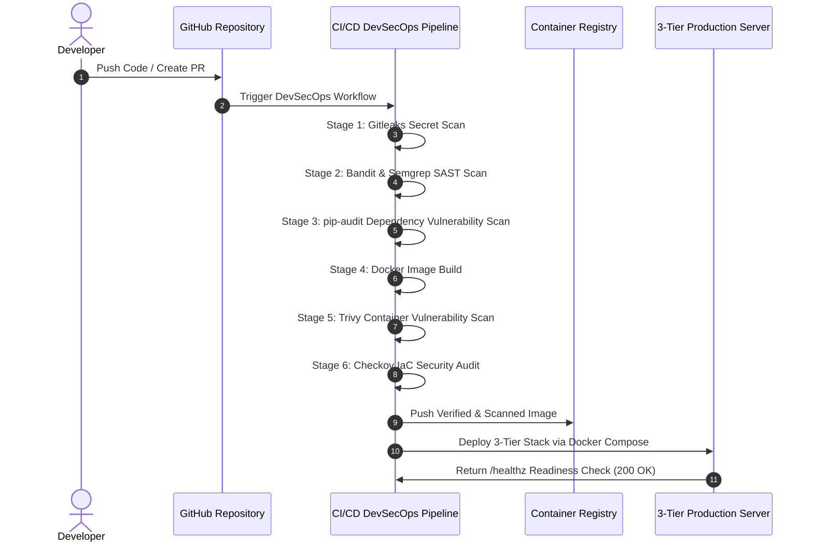

# 📐 3-Tier DevSecOps Architecture & Security Threat Model

## 1. Network Segmentation & Security Boundary Matrix

| Tier | Component | Network Subnet | Public IP | Exposed Ports | Allowed Ingress |
| :--- | :--- | :--- | :--- | :--- | :--- |
| **Tier 1 (Presentation)** | Nginx Reverse Proxy & WAF | `frontend-net` (Public Subnet) | Yes | `80`, `443` | `0.0.0.0/0` (Public HTTP/HTTPS) |
| **Tier 2 (Application)** | Flask REST API + Gunicorn | `backend-net` (Private App Subnet) | No | `5000` (Internal) | `Tier 1 Web SG` Only |
| **Tier 2 (Cache)** | Redis In-Memory Store | `backend-net` (Private App Subnet) | No | `6379` (Internal) | `Tier 2 App SG` Only |
| **Tier 3 (Database)** | MySQL 8.0 Database | `db-net` (Private DB Subnet) | No | `3306` (Internal) | `Tier 2 App SG` Only |

---

## 2. Threat Modeling & Security Control Mitigation

| Threat Vector | Potential Impact | Security Mitigation Implemented |
| :--- | :--- | :--- |
| **SQL Injection (SQLi)** | Database extraction or corruption | SQLAlchemy ORM parameterized queries; raw SQL concatenation prohibited. |
| **Cross-Site Scripting (XSS)** | Session hijacking / script execution | Server-side HTML input sanitization (`html.escape`) + Strict `Content-Security-Policy` header. |
| **Hardcoded Secret Leakage** | Repository compromise & unauthorized AWS access | Dynamic retrieval via AWS Secrets Manager & IAM Roles; `.gitignore` enforcement + Gitleaks CI/CD scanning. |
| **Denial of Service (DoS)** | Application downtime | Nginx rate limiting (`10 req/sec`) + `Flask-Limiter` middleware. |
| **Container Breakout / Privilege Escalation** | Host compromise | Hardened non-root user (`USER appuser`, UID 10001) in Dockerfile; container filesystem hardening. |
| **Insecure Direct DB Access** | Direct attacker connection to DB | DB port `3306` unexposed to host/public networks; isolated internal network topology. |

---

## 3. DevSecOps CI/CD Pipeline Flow

