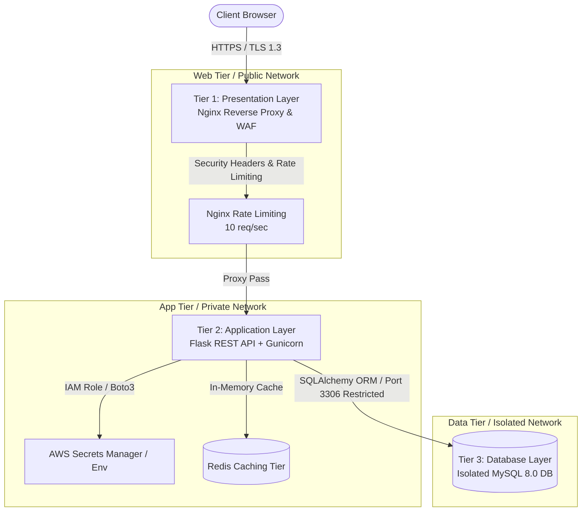
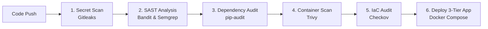

# Trident-DevSecOps

A 3-tier secure web app (guestbook) you can clone and run yourself: Nginx reverse proxy → Flask API → MySQL, all in Docker. Every push is security-scanned, and the AWS infrastructure is defined in Terraform.

```
Browser → Tier 1: Nginx (rate limit + security headers)
            → Tier 2: Flask + Gunicorn API (+ Redis cache)
              → Tier 3: MySQL (isolated network, no public ports)
```



Security basics: no hardcoded secrets (env vars or AWS Secrets Manager via IAM role), SQLAlchemy parameterized queries, HTML-escaped input + CSP headers, rate limiting at both proxy and app layers, non-root containers.

Two CI pipelines ship with the repo: **GitHub Actions** (scan-only: Gitleaks, Bandit, pip-audit, Trivy, Checkov) and **Jenkins** (scan + build + deploy + health check).



---

## Prerequisites

- Docker + Docker Compose plugin
- Python 3.11+ (local runs only)
- For AWS deploy: AWS account, AWS CLI configured (`aws configure`), an EC2 key pair

## 1. Clone

```bash
git clone https://github.com/JimilPrabtani/DevSecOps-Project-3.git
cd DevSecOps-Project-3
```

## 2. Configure

```bash
cp .env.example .env
```

Edit `.env` and set at minimum:

| Variable | How to fill it |
| :--- | :--- |
| `SECRET_KEY` | Generate: `python3 -c "import secrets; print(secrets.token_hex(32))"` |
| `MYSQL_USER` / `MYSQL_DB` | Pick names, e.g. `devops_user` / `devops_db` |
| `MYSQL_PASSWORD` / `MYSQL_ROOT_PASSWORD` | Two different strong passwords |
| `USE_REDIS` | Leave `false` unless you need Redis-backed rate limiting |

Optional for cloud: `AWS_SECRET_NAME` (e.g. `prod/devsecops/credentials`) + `AWS_DEFAULT_REGION` to pull DB credentials from Secrets Manager instead of `.env`. Never commit `.env` (already in `.gitignore`).

## 3. Run locally

```bash
docker compose up -d --build
```

Verify:

- UI: `http://localhost`
- Proxy health: `http://localhost/healthz`
- App health: `http://localhost/health`
- API: `GET /api/v1/messages`, `POST /api/v1/messages`, `GET /api/v1/metrics`

Stop: `docker compose down` (add `-v` to also wipe the database volume).

## 4. Deploy to AWS with Terraform

```bash
cd terraform
terraform init
terraform plan   # review, fix any credential/AMI/key-pair errors first
terraform apply  # type yes, note the ec2_public_ip output
```

Before `apply`, edit `terraform/variables.tf`: set `my_ip` to your IP (`https://checkip.amazonaws.com`, as `"x.x.x.x/32"`), `key_pair_name` to your existing key pair, `aws_region` + `ami_id` if outside `us-east-1`.

Then on the instance:

```bash
ssh -i devsecops-key.pem ubuntu@<EC2_PUBLIC_IP>
git clone https://github.com/JimilPrabtani/DevSecOps-Project-3.git
cd DevSecOps-Project-3
cp .env.example .env   # fill as in step 2
docker compose up -d --build
curl -f http://localhost/healthz
```

Tear down everything when done: `cd terraform && terraform destroy`.

## 5. Run the Jenkins pipeline (on EC2)

Jenkins builds, scans, deploys, and health-checks (`Jenkinsfile`, 7 stages). GitHub Actions stays as the scan-only counterpart — both are kept.

```bash
# 1. Pre-reqs on the instance
java -version; docker ps; docker compose version; trivy --version

# 2. Install Jenkins (Ubuntu)
sudo apt-get update -y
sudo apt-get install -y fontconfig openjdk-17-jre
sudo wget -O /usr/share/keyrings/jenkins-keyring.asc https://pkg.jenkins.io/debian-stable/jenkins.io-2023.key
echo "deb [signed-by=/usr/share/keyrings/jenkins-keyring.asc] https://pkg.jenkins.io/debian-stable binary/" | sudo tee /etc/apt/sources.list.d/jenkins.list
sudo apt-get update -y && sudo apt-get install -y jenkins
sudo systemctl enable --now jenkins

# 3. Allow Docker + install Trivy, then open SG port 8080 to your IP
sudo usermod -aG docker jenkins && sudo systemctl restart jenkins
# Trivy: see https://aquasecurity.github.io/trivy/latest/getting-started/installation/
```

4. Open `http://<EC2_PUBLIC_IP>:8080`, unlock with `sudo cat /var/lib/jenkins/secrets/initialAdminPassword`, install suggested plugins, create admin.
5. New Item → Pipeline → Pipeline script from SCM → Git → URL `https://github.com/JimilPrabtani/DevSecOps-Project-3.git`, branch `main`, script path `Jenkinsfile` → Save → Build Now.
6. Verify: `docker compose ps` all healthy, `curl -f http://localhost/healthz` returns `OK`.

Notes: scan stages use `|| true` so they report without failing the build; stage 7 retries the health check 6×10s because MySQL needs ~40s to become ready.

## Troubleshooting

| Symptom | Fix |
| :--- | :--- |
| `Cannot connect to the Docker daemon` | `sudo systemctl start docker && sudo systemctl enable docker`, then log out/in (or `newgrp docker`) so the `docker` group applies |
| `Tier-1-webproxy Restarting (1) mkdir() ... Permission denied` | Fixed: proxy no longer runs as `USER nginx`. Rebuild with `docker compose build web-proxy --no-cache` |
| Jenkins health check red on first run | Normal if MySQL is still starting; the retry loop handles it — check `docker compose ps` |
| `pip-audit` skipped in GitHub Actions | Fixed: deps file is now standard `requirements.txt`, which the workflow detects |
| `terraform apply` fails on AMI/key pair | `ami_id` is region-specific (`variables.tf` lists common ones); `key_pair_name` must already exist in that region |

## Layout

- `app.py`, `models.py`, `config.py` — Flask app, data model, env/Secrets Manager config
- `templates/` — UI (native `fetch`, no jQuery)
- `nginx/` — reverse proxy + rate limiting + security headers
- `terraform/` — VPC, subnets, security groups, IAM role, EC2 host
- `Jenkinsfile` — build/scan/deploy pipeline; `.github/workflows/` — scan-only pipeline
