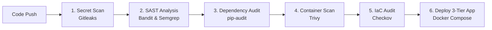

# 🛡️ Production 3-Tier DevSecOps Cloud Application

[](#-devsecops-automated-security-pipeline)
[](#-architecture-overview)
[](#-security-controls--zero-trust-design)
[](#-infrastructure-as-code-terraform)

An enterprise-grade, portfolio-worthy **3-Tier DevSecOps Web Application** demonstrating modern secure architecture, network segmentation, zero-trust credential management, static & dynamic security scanning, and automated deployment pipelines.

---

## 🏛️ Architecture Overview


---

## 🔒 Security Controls & Zero-Trust Design

### 1. Zero Hardcoded Credentials
- **Dynamic Secret Fetching**: Integrated with **AWS Secrets Manager** (`boto3`) and environment variables.
- **IAM Instance Profiles**: Eliminates storing AWS Access Keys or DB passwords in code or environment configuration files.
- **Git Hygiene**: `.gitignore` strictly configured to block credentials, `.env` files, and database dumps.

### 2. Multi-Tier Network Isolation
- **Presentation Tier (Tier 1)**: Nginx handles SSL termination, rate limiting, and HTTP security response headers.
- **Application Tier (Tier 2)**: Decoupled RESTful API running on Gunicorn with a non-root system user (`USER appuser`, UID 10001).
- **Database Tier (Tier 3)**: MySQL database container operates on an `internal: true` bridge network without public port exposure (`3306` bound exclusively inside private container subnet).

### 3. Application Security & Hardening
- **SQL Injection Prevention**: Built with **SQLAlchemy ORM** to enforce parameterized database queries.
- **XSS Mitigation**: Strict HTML escaping on input fields and custom `Content-Security-Policy` (CSP) response headers.
- **DoS Mitigation**: Nginx rate limiting (`limit_req_zone`) + `Flask-Limiter` middleware.
- **Security Response Headers**:
  - `Content-Security-Policy`
  - `Strict-Transport-Security` (HSTS)
  - `X-Frame-Options: DENY`
  - `X-Content-Type-Options: nosniff`
  - `Referrer-Policy: strict-origin-when-cross-origin`

---

## 🛡️ DevSecOps Automated Security Pipeline

The repository features an automated multi-stage security pipeline integrated into **GitHub Actions** (`.github/workflows/devsecops-pipeline.yml`) and **Jenkins** (`Jenkinsfile`):



| Security Stage | Tool Used | Description |
| :--- | :--- | :--- |
| **Secret Scanning** | `Gitleaks` | Scans commit history to detect accidentally exposed API keys or tokens. |
| **Static Code Analysis (SAST)** | `Bandit` & `Semgrep` | Audits Python source code for security flaws and unsafe function calls. |
| **Dependency Auditing** | `pip-audit` | Checks third-party Python packages against CVE vulnerability databases. |
| **Container Vulnerability Scan** | `Trivy` | Scans base OS images & built Docker containers for OS/library vulnerabilities. |
| **Infrastructure as Code Audit** | `Checkov` | Audits Dockerfiles, `docker-compose.yml`, and Terraform manifests for misconfigurations. |

---

## 🏗️ Infrastructure as Code (Terraform)

The `terraform/` directory contains modular IaC manifests to provision the entire cloud architecture on AWS:

- **`vpc.tf`**: Provisions VPC, Internet Gateway, 2 Public Subnets (Tier 1 Web), 2 Private Subnets (Tier 2 App), and 2 Private Subnets (Tier 3 RDS).
- **`security_groups.tf`**: Enforces strict security boundaries (Port 80/443 open to Web SG -> Port 5000 open to App SG -> Port 3306 open ONLY to DB SG).
- **`iam.tf`**: Provisions IAM Role & Policy for EC2 instance to dynamically retrieve secrets from AWS Secrets Manager.

---

## 🚀 Quick Start Guide (Local)

### Prerequisites
- Docker & Docker Compose
- Python 3.9+

### 1. Clone the Repository
```bash
git clone https://github.com/JimilPrabtani/DevSecOps-Project.git
cd DevSecOps-Project
```

### 2. Configure Environment Variables
```bash
cp .env.example .env
# Edit .env with your actual values (see Environment Variables section below)
```

### 3. Launch 3-Tier Application Stack
```bash
docker compose up -d --build
```

### 4. Verify Stack Deployment
- **Web UI**: Open `http://localhost`
- **Application Health**: `http://localhost/health`
- **REST API Endpoints**:
  - `GET /api/v1/messages` — Retrieve all messages
  - `POST /api/v1/messages` — Create a new message
  - `GET /api/v1/metrics` — Application metrics & status

---

## ☁️ AWS Cloud Deployment Guide

This section walks you through deploying the full 3-Tier application stack on **AWS EC2** using Docker Compose, step by step.

### Prerequisites
- An **AWS Account** with IAM permissions for EC2, VPC, and Secrets Manager
- **AWS CLI** installed and configured (`aws configure`)
- A registered **SSH key pair** created in AWS EC2 Console (`.pem` file)

---

### Step 1: Provision an EC2 Instance

1. Go to [AWS EC2 Console](https://console.aws.amazon.com/ec2) → **Launch Instance**.
2. Choose:
   - **AMI**: Ubuntu Server 22.04 LTS (Free Tier eligible)
   - **Instance Type**: `t2.micro` (Free Tier) or `t3.small` for better performance
   - **Key Pair**: Select or create a `.pem` key pair — **save it securely**.
3. Under **Network Settings**, configure the **Security Group** to allow:
   - Port `22` (SSH) — restrict to your IP (`My IP`)
   - Port `80` (HTTP) — allow `0.0.0.0/0`
   - Port `443` (HTTPS) — allow `0.0.0.0/0`
4. Under **Advanced Details → IAM Instance Profile**, attach the IAM role provisioned by `terraform/iam.tf` (or create one that has `secretsmanager:GetSecretValue` permission).
5. Set storage to at least **20 GiB**.
6. Click **Launch Instance**.

---

### Step 2: Connect to Your EC2 Instance via SSH

```bash
chmod 400 your-key.pem
ssh -i your-key.pem ubuntu@<EC2_PUBLIC_IP>
```

Replace `<EC2_PUBLIC_IP>` with your instance's public IPv4 address from the EC2 console.

---

### Step 3: Install Docker & Docker Compose on EC2

Run the following on your EC2 instance:

```bash
# Update package list
sudo apt-get update -y

# Install Docker
sudo apt-get install -y docker.io docker-compose-plugin

# Start Docker and enable on boot
sudo systemctl start docker
sudo systemctl enable docker

# Add ubuntu user to docker group (no sudo required)
sudo usermod -aG docker ubuntu

# Re-login to apply group change
exit
ssh -i your-key.pem ubuntu@<EC2_PUBLIC_IP>
```

---

### Step 4: Clone the Repository on EC2

```bash
git clone https://github.com/JimilPrabtani/DevSecOps-Project.git
cd DevSecOps-Project
```

---

### Step 5: Configure Environment Variables

```bash
cp .env.example .env
nano .env
```

Fill in all the required values (see **Environment Variables Reference** section below).

---

### Step 6: (Optional) Store Secrets in AWS Secrets Manager

Instead of using a plain `.env` file, you can securely store credentials in **AWS Secrets Manager**:

```bash
aws secretsmanager create-secret \
  --name prod/devsecops/credentials \
  --region us-east-1 \
  --secret-string '{
    "MYSQL_USER": "devops_user",
    "MYSQL_PASSWORD": "YourSecurePassword123!",
    "MYSQL_HOST": "mysql",
    "MYSQL_PORT": "3306",
    "MYSQL_DB": "devops_db"
  }'
```

Then in your `.env` file, set:
```env
AWS_SECRET_NAME=prod/devsecops/credentials
AWS_DEFAULT_REGION=us-east-1
```

The application will automatically fetch credentials from Secrets Manager at runtime via the EC2 IAM Role — no passwords stored on disk.

---

### Step 7: Deploy the 3-Tier Stack

```bash
docker compose up -d --build
```

Verify all containers are running:
```bash
docker compose ps
```

You should see:
```
NAME                    STATUS         PORTS
tier1-web-proxy         Up (healthy)   0.0.0.0:80->80/tcp
tier2-app-service       Up (healthy)   5000/tcp
tier2-redis-cache       Up             6379/tcp
tier3-database          Up (healthy)   3306/tcp
```

---

### Step 8: Access the Application

Open your browser and navigate to:
```
http://<EC2_PUBLIC_IP>
```

Verify the health endpoint:
```bash
curl http://<EC2_PUBLIC_IP>/health
```

Expected response:
```json
{
  "status": "UP",
  "database": "healthy",
  "environment": "production"
}
```

---

### Step 9: (Optional) Point a Domain & Enable HTTPS

If you have a domain name:
1. In **Route 53** (or your DNS provider), create an **A record** pointing to your `<EC2_PUBLIC_IP>`.
2. Install **Certbot** on EC2 to get a free SSL certificate from Let's Encrypt:
   ```bash
   sudo apt install certbot
   sudo certbot certonly --standalone -d yourdomain.com
   ```
3. Update `nginx/nginx.conf` to reference your SSL certificate paths and change `listen 80` to `listen 443 ssl`.

---

## 🏗️ Deploy with Terraform (Infrastructure as Code)

This section is an **alternative to the manual AWS Console approach** above. Instead of clicking through the AWS UI, Terraform provisions your entire cloud infrastructure automatically — VPC, subnets, security groups, IAM roles, and EC2 instance — with a single command.

> [!IMPORTANT]
> Run Terraform **before** SSHing into any EC2 instance or deploying Docker. Terraform creates the infrastructure first, then you deploy the application onto it.

---

### ✅ Pre-flight Checklist (Complete ALL of these before running any command)

Work through this checklist top to bottom. **Every item is a hard requirement** — skipping any one of them will cause `terraform apply` to fail.

---

#### 1. Install Required Tools on Your Local Machine

> [!NOTE]
> **Before doing anything else**, verify these three tools are installed. None of the following steps will work without them.

| Tool | Version | How to Install |
| :--- | :--- | :--- |
| **Terraform** | ≥ 1.0.0 | [terraform.io/downloads](https://developer.hashicorp.com/terraform/downloads) — download, unzip, add to PATH |
| **AWS CLI** | ≥ 2.x | [aws.amazon.com/cli](https://aws.amazon.com/cli/) — run installer |
| **Git** | any | [git-scm.com](https://git-scm.com/) |

Run all three to confirm they're on your PATH:
```bash
terraform -version
aws --version
git --version
```

---

#### 2. Create an AWS Account & IAM User

- Go to [aws.amazon.com](https://aws.amazon.com) → **Create an AWS Account** if you don't have one.
- AWS Console → **IAM** → **Users** → **Create user**.
- Attach these managed policies to the IAM user:
  - `AmazonEC2FullAccess`
  - `AmazonVPCFullAccess`
  - `IAMFullAccess`
  - `SecretsManagerReadWrite`
- **Security credentials** → **Access keys** → **Create access key** → choose **CLI** → **Download `.csv`**.

> [!CAUTION]
> Never commit your AWS Access Key ID or Secret Access Key to Git. Only store them in the AWS CLI config.

---

#### 3. Configure the AWS CLI

> [!NOTE]
> **File to set up: none.** This step writes credentials into `~/.aws/credentials` on your machine automatically.

```bash
aws configure
```

Fill in the prompts:
```
AWS Access Key ID:     → Paste from the .csv you downloaded
AWS Secret Access Key: → Paste from the .csv
Default region name:   → e.g. us-east-1  (must match what you'll set in variables.tf)
Default output format: → json
```

**Verify it works before moving on:**
```bash
aws sts get-caller-identity
```
You should see your Account ID, user ARN, and user ID. If you get an error, your credentials are wrong — fix this before continuing.

---

#### 4. Create an EC2 Key Pair

> [!NOTE]
> **File to save: `devsecops-key.pem`** — Keep this file safe on your local machine. You will use it to SSH into your EC2 instance after Terraform creates it.

```bash
aws ec2 create-key-pair \
  --key-name devsecops-key \
  --region us-east-1 \
  --query 'KeyMaterial' \
  --output text > devsecops-key.pem

chmod 400 devsecops-key.pem
```

> [!IMPORTANT]
> Replace `us-east-1` with your region if different. The key pair name `devsecops-key` must **exactly match** what you'll set in the next step. You cannot download the `.pem` file again after this step.

---

#### 5. Edit `terraform/variables.tf` — The ONLY File You Must Edit Before Running Terraform

> [!IMPORTANT]
> **Open `terraform/variables.tf` now.** This is the single file you need to configure before running any Terraform command. Every variable that has a `# ✏️ CHANGE THIS` comment needs your attention.

Here is what to fill in, variable by variable:

| Variable | Location in File | What to Set |
| :--- | :--- | :--- |
| `aws_region` | Line 4 — `default = "us-east-1"` | Change to your AWS region. Must match the region you used in `aws configure` and `create-key-pair`. |
| `key_pair_name` | Line 26 — `default = "devsecops-key"` | Must exactly match the `--key-name` you used in Step 4. If you named it differently, change this. |
| `my_ip` | Line 32 — `default = "0.0.0.0/0"` | **Change this for security.** Go to [checkip.amazonaws.com](https://checkip.amazonaws.com), copy your IP, and set it as `"YOUR.IP.HERE/32"` (e.g. `"203.0.113.45/32"`). This restricts SSH to your machine only. |
| `instance_type` | Line 38 — `default = "t2.micro"` | Leave as `t2.micro` for Free Tier. Change to `t3.small` if you want more RAM. |
| `ami_id` | Line 44 — `default = "ami-0c7217cdde317cfec"` | **Change if your region is NOT `us-east-1`.** The AMI ID in the file is region-specific. Refer to the comment inside the file for a list of common region AMI IDs. |

After editing, `terraform/variables.tf` will look something like this (your values will differ):
```hcl
variable "aws_region" {
  default = "ap-south-1"    # ← Your region
}

variable "key_pair_name" {
  default = "devsecops-key" # ← Must match your .pem file name
}

variable "my_ip" {
  default = "203.0.113.45/32" # ← Your actual public IP
}

variable "ami_id" {
  default = "ami-006935d9a6773e4ec" # ← Ubuntu 22.04 AMI for ap-south-1
}
```

**No other Terraform file needs to be manually edited.** `main.tf`, `vpc.tf`, `security_groups.tf`, `iam.tf`, and `ec2.tf` all reference `var.*` variables — they pick up your values automatically.

---

#### 6. Clone the Repository Locally

> [!NOTE]
> If you already cloned the repo, skip this step. Just make sure you're in the `DevSecOps-Project` directory.

```bash
git clone https://github.com/JimilPrabtani/DevSecOps-Project.git
cd DevSecOps-Project
```

---

### 🚀 Terraform Deployment Commands

Once Steps 1–6 are complete, run these commands **in order** from inside the `terraform/` directory.

---

#### Step 1 — Navigate into the Terraform Directory

> **Before running:** Make sure you completed the entire Pre-flight Checklist above, especially editing `terraform/variables.tf`.

```bash
cd terraform/
```

---

#### Step 2 — `terraform init` (Downloads AWS Provider Plugin)

> **Before running:** Nothing extra needed. `init` only downloads the Terraform AWS provider — it does not connect to your AWS account yet and does not create anything.

```bash
terraform init
```

**What happens:** Terraform reads `main.tf`, sees `source = "hashicorp/aws"`, and downloads the plugin into a `.terraform/` folder. You will see:
```
Terraform has been successfully initialized!
```

If you see an error here, it usually means Terraform is not installed correctly or you are not in the `terraform/` directory.

---

#### Step 3 — `terraform plan` (Preview — Nothing Gets Created Yet)

> **Before running:**
> - Your `terraform/variables.tf` must be fully filled in (Step 5 of pre-flight).
> - `aws configure` must be done (Step 3 of pre-flight).
> - `aws sts get-caller-identity` must return your account details.

```bash
terraform plan
```

**What happens:** Terraform connects to AWS and calculates exactly what it would create. It prints a diff showing every resource: VPC, subnets, security groups, IAM role, EC2 instance. **Read this output** — look for any `Error:` lines before proceeding. Nothing is created yet.

Common errors at this step and fixes:

| Error Message | Fix |
| :--- | :--- |
| `No valid credential sources found` | Run `aws configure` again |
| `InvalidAMIID.NotFound` | Your `ami_id` in `variables.tf` is wrong for your region. Check the comment in `variables.tf` for the correct AMI. |
| `InvalidKeyPair.NotFound` | Your `key_pair_name` doesn't match the key pair in AWS. Check `aws ec2 describe-key-pairs`. |

---

#### Step 4 — `terraform apply` (Creates Everything on AWS)

> **Before running:**
> - `terraform plan` must have completed **with no errors**.
> - Review the plan output — confirm the resource list looks right.
> - You will be prompted to type `yes` to confirm before anything is created.

```bash
terraform apply
```

Type `yes` when prompted. Terraform will create:
- VPC with public and private subnets (3 tiers)
- Internet Gateway and Route Tables
- 3 Security Groups (Web, App, DB) with least-privilege rules
- IAM Role + Instance Profile for Secrets Manager access
- EC2 instance (Ubuntu 22.04) with Docker pre-installed via `user_data`

When complete, Terraform prints outputs:
```
ec2_public_ip             = "54.x.x.x"
vpc_id                    = "vpc-xxxxxxxxxxxxxxxxx"
web_security_group_id     = "sg-xxxxxxxxxxxxxxxxx"
app_security_group_id     = "sg-xxxxxxxxxxxxxxxxx"
db_security_group_id      = "sg-xxxxxxxxxxxxxxxxx"
iam_instance_profile_name = "devsecops-ec2-instance-profile"
```

**Copy the `ec2_public_ip` value** — you need it in the next step.

---

### 🔗 Post-Terraform: Deploy the Application onto EC2

After `terraform apply` completes, deploy the app onto the provisioned EC2 instance.

---

#### Step 5 — SSH Into the EC2 Instance

> **Before running:** Wait 1–2 minutes after `terraform apply` finishes. The instance needs time to boot and finish running the Docker install script.

```bash
ssh -i devsecops-key.pem ubuntu@<EC2_PUBLIC_IP>
```

Replace `<EC2_PUBLIC_IP>` with the IP printed by `terraform apply`. The `.pem` file must be the one created in Step 4 of the pre-flight, and it must have `chmod 400` applied.

---

#### Step 6 — Clone Repository & Configure `.env`

> **Before running:**
> - You must be logged into the EC2 instance (inside the SSH session).
> - Have your database passwords and `SECRET_KEY` ready. See **Environment Variables Reference** below for every value you need.

```bash
git clone https://github.com/JimilPrabtani/DevSecOps-Project.git
cd DevSecOps-Project
cp .env.example .env
nano .env
```

In `nano`, fill in all values marked with `# CHANGE THIS`. When done: press `Ctrl+X`, then `Y`, then `Enter` to save.

**Minimum values you must set in `.env`:**
```env
SECRET_KEY=<generate with: python3 -c "import secrets; print(secrets.token_hex(32))">
MYSQL_USER=devops_user
MYSQL_PASSWORD=<choose a strong password>
MYSQL_DB=devops_db
MYSQL_ROOT_PASSWORD=<choose a different strong password>
FLASK_ENV=production
```

---

#### Step 7 — Launch the 3-Tier Stack

> **Before running:** Your `.env` file must be saved with all required values filled in (Step 6).

```bash
docker compose up -d --build
```

Verify all 4 containers started:
```bash
docker compose ps
```

Expected output:
```
NAME                    STATUS         PORTS
tier1-web-proxy         Up (healthy)   0.0.0.0:80->80/tcp
tier2-app-service       Up (healthy)   5000/tcp
tier2-redis-cache       Up             6379/tcp
tier3-database          Up (healthy)   3306/tcp
```

---

#### Step 8 — Verify the App is Live

Open your browser and go to:
```
http://<EC2_PUBLIC_IP>
```

Or check the health endpoint:
```bash
curl http://<EC2_PUBLIC_IP>/health
```

Expected:
```json
{ "status": "UP", "database": "healthy", "environment": "production" }
```

---

### 🧹 Tear Down (Destroy All AWS Resources)

> [!WARNING]
> Run this when you are done to avoid ongoing AWS charges. This permanently deletes all infrastructure Terraform created.

```bash
cd terraform/
terraform destroy
```

Type `yes` to confirm. All EC2 instances, VPC, subnets, security groups, and IAM roles will be deleted.

---


## 🔑 Environment Variables Reference

All environment variables are configured in your `.env` / `.env.example` file. They are read at runtime by `config.py` and injected into containers by `docker-compose.yml`. The table below shows every variable, what it does, where to get it, and the **exact file and line** where it is consumed in the codebase.

> [!IMPORTANT]
> Never commit your `.env` file to Git. It is already blocked by `.gitignore` (line 2).

---

### Application Settings

| Variable | Required | Example Value | Description | Where to Get It | Used In (File → Line) |
| :--- | :---: | :--- | :--- | :--- | :--- |
| `FLASK_ENV` | ✅ | `production` | Sets Flask environment mode. Use `production` for cloud, `development` for local. | Set manually. | `.env.example` (line 5) · `app.py` (line 140) · `docker-compose.yml` (line 37) |
| `SECRET_KEY` | ✅ | `Xf8k!...` | Flask session signing key. Must be long, random, and unique. | Generate with: `python -c "import secrets; print(secrets.token_hex(32))"` | `.env.example` (line 6) · `config.py` (line 33) · `docker-compose.yml` (line 38) |
| `PORT` | ❌ | `5000` | Port the Flask/Gunicorn server listens on inside the container. | Leave as `5000` unless changed in `docker-compose.yml`. | `.env.example` (line 7) · `app.py` (line 159) |

---

### Database Credentials (MySQL)

| Variable | Required | Example Value | Description | Where to Get It | Used In (File → Line) |
| :--- | :---: | :--- | :--- | :--- | :--- |
| `MYSQL_HOST` | ✅ | `mysql` | Hostname of the MySQL service. In Docker Compose, this matches the service name. | Leave as `mysql` (Docker internal DNS). For AWS RDS, use the RDS Endpoint URL from the RDS Console. | `.env.example` (line 10) · `config.py` (line 43) · `docker-compose.yml` (line 39) |
| `MYSQL_PORT` | ✅ | `3306` | MySQL connection port. | Always `3306` unless customized. | `.env.example` (line 11) · `config.py` (line 44) · `docker-compose.yml` (line 40) |
| `MYSQL_USER` | ✅ | `devops_user` | Non-root MySQL application user. | You define this. Choose a non-root username. | `.env.example` (line 12) · `config.py` (line 41) · `docker-compose.yml` (line 41 & 56) |
| `MYSQL_PASSWORD` | ✅ | `Str0ng!Pass#99` | Password for the MySQL application user. | You define this. Use a strong password (12+ chars, uppercase, lowercase, numbers, symbols). | `.env.example` (line 13) · `config.py` (line 42) · `docker-compose.yml` (line 42 & 57) |
| `MYSQL_DB` | ✅ | `devops_db` | Name of the database the application uses. | You define this. Must match the DB created during MySQL initialization. | `.env.example` (line 14) · `config.py` (line 45) · `docker-compose.yml` (line 43 & 55) |
| `MYSQL_ROOT_PASSWORD` | ✅ | `R00t!Secure#22` | MySQL root/admin password. Only used during DB initialization. | You define this. Never reuse the app user password for root. | `.env.example` (line 15) · `docker-compose.yml` (line 54) |

---

### Redis Cache Settings

| Variable | Required | Example Value | Description | Where to Get It | Used In (File → Line) |
| :--- | :---: | :--- | :--- | :--- | :--- |
| `USE_REDIS` | ❌ | `false` | Set to `true` to enable Redis for rate limiting storage. | Set to `true` when deploying Redis container in production. | `.env.example` (line 18) · `config.py` (line 61) · `docker-compose.yml` (line 44) |
| `REDIS_HOST` | ❌ | `redis` | Hostname of the Redis service. Matches Docker Compose service name. | Leave as `redis`. | `.env.example` (line 19) · `config.py` (line 56) · `docker-compose.yml` (line 45) |
| `REDIS_PORT` | ❌ | `6379` | Redis connection port. | Always `6379` unless changed. | `.env.example` (line 20) · `config.py` (line 57) |

---

### AWS Secrets Manager Integration (Recommended for Cloud)

| Variable | Required | Example Value | Description | Where to Get It | Used In (File → Line) |
| :--- | :---: | :--- | :--- | :--- | :--- |
| `AWS_SECRET_NAME` | ❌ | `prod/devsecops/credentials` | Name of the secret in AWS Secrets Manager containing DB credentials. When set, overrides all `MYSQL_*` env vars. | **AWS Console** → Secrets Manager → Create Secret → Copy the secret name. | `.env.example` (line 23) · `config.py` (line 36) |
| `AWS_DEFAULT_REGION` | ❌ | `us-east-1` | AWS region where your Secrets Manager secret is stored. | **AWS Console** → Top-right region selector (e.g., `us-east-1`, `ap-south-1`). | `.env.example` (line 24) · `config.py` (line 12 — passed to `boto3` session) · `terraform/variables.tf` (line 5) |

> [!NOTE]
> When `AWS_SECRET_NAME` is set and the EC2 instance has an IAM Role with `secretsmanager:GetSecretValue` permission, the app automatically fetches all `MYSQL_*` credentials from Secrets Manager at startup. You do **not** need to set `MYSQL_PASSWORD` or `MYSQL_USER` in `.env` when using this method.

---

### Where to Find Each Value — Quick Reference

| What You Need | Where to Find It |
| :--- | :--- |
| **EC2 Public IP** | AWS Console → EC2 → Instances → Select instance → Public IPv4 address |
| **EC2 SSH Key Pair** | AWS Console → EC2 → Key Pairs → Create key pair → Download `.pem` |
| **AWS Region** | AWS Console → Top-right corner (e.g., `US East (N. Virginia)` = `us-east-1`) |
| **Secrets Manager Secret Name** | AWS Console → Secrets Manager → Secrets → Copy the Secret name |
| **IAM Role ARN** | AWS Console → IAM → Roles → Select role → Copy ARN |
| **Flask SECRET_KEY** | Generate locally: `python -c "import secrets; print(secrets.token_hex(32))"` |
| **MySQL Passwords** | You define these yourself. Use a password manager to generate strong passwords. |
| **RDS Endpoint (if using RDS)** | AWS Console → RDS → Databases → Select DB → Connectivity & security → Endpoint |

---

## 💼 Resume & Portfolio Summary

> **Cloud Security / DevSecOps Project Highlights:**
> - Architected and deployed an end-to-end **3-Tier Cloud Web Application** on AWS EC2 utilizing Nginx, Flask Gunicorn, Redis, and MySQL with multi-tier network isolation.
> - Implemented a comprehensive **DevSecOps Automated Pipeline** incorporating SAST (Bandit), secret scanning (Gitleaks), dependency auditing (pip-audit), and container vulnerability scanning (Trivy).
> - Enforced **Zero-Trust Credential Management** by eliminating hardcoded secrets and integrating dynamic retrieval via AWS Secrets Manager & IAM Role Instance Profiles.
> - Authored modular **Terraform Infrastructure as Code (IaC)** defining VPC subnets, Security Groups with least-privilege egress/ingress boundaries, and IAM policies.